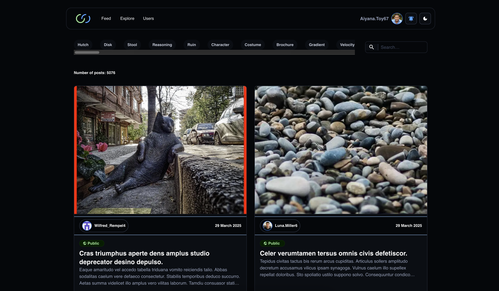

# Social Media Next.js GraphQL Application

A modern social media application built with Next.js, GraphQL, and Material-UI. The project features multiple feeds, including a private feed for friends' posts, an explore feed for public posts, and a profile feed, all with search and filtering functionalities. It also includes a friendship system, notifications, and post interactions such as likes and comments.
Project Deployed using <a href="https://vercel.com/">Vercel</a> and a Postgres <a href="https://railway.com/">Railway</a> database.

## 🚀 Features

- **Modern Tech Stack**
  - Next.js 15 with App Router
  - GraphQL API with Apollo Server
  - Material-UI v6 for beautiful UI components
  - TypeScript for type safety
  - Prisma as the ORM
  - AWS S3 for file storage

- **Authentication & Authorization**
  - Secure user authentication
  - JWT token management

- **Social Features**
  - User profiles
  - Multiple feeds, private, and a explore public feed
  - Posts and comments
  - Real-time updates
  - File uploads

## 🛠️ Technologies Used

This project leverages a modern tech stack of libraries and frameworks:

### Core Framework
- **Next.js (v15.1.6)** - React framework with App Router for improved routing and server components
- **React (v19.0.0)** - Latest version with improved rendering and concurrent mode
- **TypeScript (v5.7.3)** - Strong type safety throughout the application

### GraphQL Ecosystem
- **Apollo Server (v4.11.3)** - Powers the GraphQL API backend
- **Apollo Client (v3.12.8)** - Client-side data fetching with caching
- **Nexus (v1.3.0)** - Code-first GraphQL schema generation
- **GraphQL Depth Limit** - Protection against malicious queries

### Database & ORM
- **Prisma (v6.3.0)** - Modern ORM with type-safe database access
- **@prisma/client (v6.2.1)** - Generated Prisma client for database operations

### Authentication
- **NextAuth (v4.24.11)** - Flexible authentication with multiple providers
- **@next-auth/prisma-adapter** - Prisma adapter for NextAuth
- **Bcrypt (v5.1.1)** - Secure password hashing

### UI Framework
- **Material-UI (v6.4.1)** - Complete UI component library
- **Emotion (v11.14.0)** - CSS-in-JS styling solution
- **MUI Icons** - Extensive icon library

### File Storage
- **AWS SDK for S3 (v3.740.0)** - Cloud file storage integration

### Testing
- **Jest (v29.7.0)** - Testing framework
- **ts-jest** - TypeScript support for Jest
- **Faker.js (v9.5.0)** - Realistic test data generation

## 🛠️ Prerequisites

- Node.js (v18 or higher)
- npm or yarn
- Docker and Docker Compose (for local development)
- AWS S3 bucket (for file storage)
- PostgreSQL database (docker container)

## 📦 Installation

1. Clone the repository:
   ```bash
   git clone https://github.com/yourusername/social-media-nextjs-graphql-app.git
   cd social-media-nextjs-graphql-app
   ```

2. Install dependencies:
   ```bash
   npm install
   # or
   yarn install
   ```

3. Set up environment variables:
   Copy the `.env.development` file to `.env.local`:
   ```bash
   cp .env.development .env.local
   ```
   
   Then edit `.env.local` to update the following variables with your own values:
   ```
   # AWS credentials
   NEXT_PUBLIC_AWS_S3_ACCESS_KEY_ID="your_aws_access_key"
   NEXT_PUBLIC_AWS_S3_SECRET_ACCESS_KEY="your_aws_secret_key"
   
   # Google OAuth credentials
   GOOGLE_CLIENT_ID="your_google_client_id"
   GOOGLE_CLIENT_SECRET="your_google_client_secret"
   
   # Database connection
   DATABASE_URL="your_database_connection_string"
   
   # JWT and NextAuth secrets
   JWT_SECRET="your_jwt_secret"
   NEXTAUTH_SECRET="your_nextauth_secret"
   ```

4. Start the PostgreSQL database and pgadmin:
   ```bash
   docker-compose up -d
   ```

5. Set up the database:
   ```bash
   npx prisma generate
   npx prisma migrate dev
   ```

6. Seed the database with initial data:
   ```bash
   npx prisma db seed
   ```

7. Start the development server:
   ```bash
   npm run dev
   # or
   yarn dev
   ```

## 🏗️ Project Structure

```
src/
├── app/              # Next.js app router pages
├── components/       # Reusable React components
├── fragments/        # GraphQL fragments
├── lib/             # Core functionality and configurations
├── services/        # Business logic and API services
├── types/           # TypeScript type definitions
└── utils/           # Utility functions
```

## 🧪 Testing

Run the test suite:
```bash
npm test
# or
yarn test
```

## 🚀 Deployment

The application is configured for deployment on Vercel. The build process includes:
1. Prisma schema generation
2. Database migrations
3. Next.js build

```bash
npm run vercel-build
# or
yarn vercel-build
```

## 📝 API Documentation

The GraphQL API documentation is available at `/api/graphql` when running the development server.

## 🤝 Contributing

1. Fork the repository
2. Create your feature branch (`git checkout -b feature/feature-name`)
3. Commit your changes (`git commit -m 'Add some new features'`)
4. Push to the branch (`git push origin feature/amazing-name`)
5. Open a Pull Request

## 🖼️ Screenshots

Project screenshots:

<p align="center">
  <table>
    <tr>
      <td></td>
      <td></td>
    </tr>
    <tr>
      <td></td>
      <td></td>
    </tr>
    <tr>
      <td></td>
      <td></td>
    </tr>
    <tr>
      <td></td>
    </tr>
  </table>
</p>